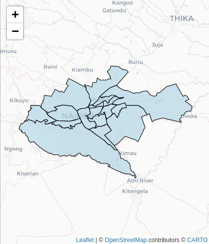

# Spatial Analysis in R using `sf` Package

## Overview

This repository contains R scripts and data files for conducting spatial analysis using the `sf` package in R. The `sf` package provides a convenient way to work with spatial data in R, allowing for manipulation, visualization, and analysis of spatial datasets.
### Spatial Map of Nairobi County

## Requirements

- R (version 4.0.1 or higher)
- RStudio (optional but recommended)
- `sf` package (install using `install.packages("sf")`)
- Other necessary packages specified in the scripts

## Usage

1. Clone or download this repository to your local machine.
2. Open RStudio or any other R environment.
3. Set your working directory to the location where you cloned/downloaded the repository.
4. Open the R script files (`analysis.R`, `visualization.R`, etc.) in RStudio.
5. Modify the scripts as needed to fit your specific analysis requirements.
6. Run the scripts line by line or all at once to execute the spatial analysis.
7. Refer to the comments within the scripts for explanations of each step.
8. Output files, plots, and results will be saved in the specified directories.

## Contents

- `data/`: Folder containing spatial data files used in the analysis.
- `analysis.R`: R script for conducting spatial analysis tasks.
- `visualization.R`: R script for generating visualizations of spatial data.
- `output/`: Folder containing output files, plots, and results generated by the scripts.
- `README.md`: This file providing an overview of the repository.

## Contributing

If you find any issues or have suggestions for improvements, feel free to open an issue or submit a pull request.

## License

This project is licensed under the [MIT License](LICENSE).

## Acknowledgments

- Special thanks to the developers of the `sf` package and other packages used in this analysis.
- Acknowledge any data sources or references used in the analysis.

## Contact

For questions or further assistance, please contact [Maurice Oboya](mailto:oboyamaurice@gmail.com).
